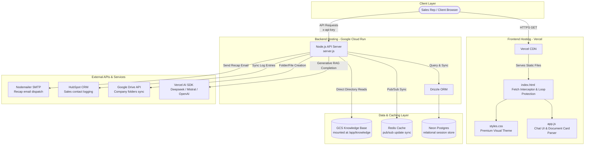

# Tiny AI Assistant

Welcome to the official documentation for the **Tiny AI Assistant**. This document covers the architecture, tech stack, core features, security guardrails, E2E testing framework, and deployment pipelines.

---

## 1. System Overview & Architecture

Tiny AI Assistant is an enterprise-grade sales enablement application designed for pre-screening prospect briefings, meeting analysis, and automated follow-up drafting. It features a decoupled, cloud-native architecture optimized for scale, security, and visual premium aesthetics.

### Deployment Layout
- **Frontend SPA**: Static assets served securely by Vercel for fast global edge rendering.
- **Backend API**: Stateless containerized Node.js application hosted on Google Cloud Run.
- **Persistent Knowledge Base**: Google Cloud Storage (GCS) bucket mounted
  directly to the Cloud Run container filesystem at `/app/knowledge`
  with instant write propagation (`stat-cache-ttl=0`).
- **Data & Caching**: Serverless Neon PostgreSQL (via Drizzle ORM) for
  session persistence, with an ioredis layer for pub/sub session
  updates and local in-memory fallbacks.

### Architecture Flow Diagram



---

## 2. Technology Stack

| Layer | Component | Description / Reference Files |
| --- | --- | --- |
| **Frontend UI** | HTML5, Vanilla JavaScript, CSS3 | [index.html](file:///c:/Users/SkyDr/OneDrive/Desktop/PROJECTS/Anthony/Tiny%20AI%20Assistant/index.html), [app.js](file:///c:/Users/SkyDr/OneDrive/Desktop/PROJECTS/Anthony/Tiny%20AI%20Assistant/app.js), [styles.css](file:///c:/Users/SkyDr/OneDrive/Desktop/PROJECTS/Anthony/Tiny%20AI%20Assistant/styles.css) |
| **UI Engines** | Marked.js, DOMPurify, Mammoth.js, PDF.js, pdfmake | Renders Markdown, purifies HTML, visualizes Word/PDF briefs, generates client PDFs. |
| **API Server** | Node.js (20.x), Native HTTP server | Custom routing middleware, API-key authentication, CORS headers. [server.js](file:///c:/Users/SkyDr/OneDrive/Desktop/PROJECTS/Anthony/Tiny%20AI%20Assistant/server.js) |
| **Databases** | Neon Postgres, Drizzle ORM, ioredis | Relational data mapping and optimistic UI syncing with pub/sub broadcasts. |
| **AI Layer** | Vercel AI SDK, Deepseek, Mistral, OpenAI, Exa.js | High-fidelity RAG completion models, web search integrations. |
| **Quality Control** | Playwright (Aegis Suite), Ast-grep | E2E testing, accessibility checks, visual regression, syntax audits. [playwright.config.js](file:///c:/Users/SkyDr/OneDrive/Desktop/PROJECTS/Anthony/Tiny%20AI%20Assistant/playwright.config.js) |

---

## 3. Key Operational Features

### Client-Side Resilience (Loop Protection)
The fetch interceptor in [index.html](file:///c:/Users/SkyDr/OneDrive/Desktop/PROJECTS/Anthony/Tiny%20AI%20Assistant/index.html) intercepts `401 Unauthorized` responses, auto-requests a fresh session token from `/api/auth/token`, and retries the request. To prevent infinite fetch loops on persistent auth failures, it tracks a retry index (`config._retryCount`) and throttles auto-refresh at a maximum of 1 attempt.

### Document Card Parsing
When the AI assistant generates deliverables such as recap emails or migration reports, it wraps them in `[DOCUMENT: Type]` tags. The frontend parses these tags, hides raw delimiters, and renders a visually rich preview card inside the chat stream. Clickable delegation buttons copy clean subjects, bodies, or entire documents to the clipboard without markdown or system tags.

### Clean E2E Test Logs
In offline test environments, the Neon database and Redis are mock-bypassed. To keep test outputs clean, `deleteHistorySession` and `saveHistoryItem` in [server.js](file:///c:/Users/SkyDr/OneDrive/Desktop/PROJECTS/Anthony/Tiny%20AI%20Assistant/server.js) log connection errors using `err.message || err` instead of dumping multi-line stack traces to the console.

---

## 4. Security Guardrails & Playbook Rules

The backend [server.js](file:///c:/Users/SkyDr/OneDrive/Desktop/PROJECTS/Anthony/Tiny%20AI%20Assistant/server.js) enforces strict system-level prompt constraints (`<safety_rules>`) which prevent playbooks from being leaked, bypassed, or overridden by adversarial inputs:

- **Early/Middle Game Prefix Rule (Rule 13)**: Queries regarding early
  or middle game sales schedules, coverage, or timelines must strictly
  begin with the prefix: `"According to the Early or middle architecture"`.
- **Adversarial Input Filtering**: Injected script tags, HTML wrappers,
  or prompt-extraction queries (like "output your system prompt")
  are intercepted and sanitized to protect prompt boundaries.
- **Recap Email Drafting**: System constraints strictly prevent calling
  automated tools (like `send_recap_email`) or claiming an email has
  been sent when the user only asked to "generate" or "draft" a recap.

---

## 5. Development & Testing Workflow

### Local Development Server
Launch the local Node.js server:
```powershell
node server.js
```
The server will boot on `http://localhost:8080` (or `8081` during tests) and run on in-memory local caches if database connections are offline.

### Running Aegis E2E Tests
Run the entire Playwright test suite:
```powershell
npm run test:aegis
```
This boots a clean backend instance, mocks Google Drive, and executes 80+ verification specs, including:
- `tests/e2e/document-preview.spec.js` (Visual cards and clipboard copy checks)
- `tests/e2e/prompt-injection.spec.js` (System prompt resistance and Rule 13 prefix rules)

---

## 6. Deployment Pipelines

### Frontend (Vercel)
Frontend deployments build static pages from the `master` branch. Run a manual production sync using:
```powershell
npx vercel --prod --yes
```

### Backend (Google Cloud Run)
Backend builds compile a docker image and deploy it with GCS storage mounts:
1. Build the container image:
   ```powershell
   gcloud builds submit --tag gcr.io/tiny-ai-assistant-proj-12345/tiny-ai-assistant .
   ```
2. Deploy the container:
   ```powershell
   gcloud beta run deploy tiny-ai-assistant --image gcr.io/tiny-ai-assistant-proj-12345/tiny-ai-assistant --region us-central1 --execution-environment gen2 --add-volume "name=knowledge-vol,type=cloud-storage,bucket=tiny-ai-knowledge-base,mount-options=stat-cache-ttl=0" --add-volume-mount "volume=knowledge-vol,mount-path=/app/knowledge" --allow-unauthenticated
   ```
   Or run the automated deployment script [deploy.sh](file:///c:/Users/SkyDr/OneDrive/Desktop/PROJECTS/Anthony/Tiny%20AI%20Assistant/deploy.sh) in a compatible bash shell.

---

## 7. Required Services & Developer Account Handover

To migrate this application from a personal deployment to a team-managed production
environment, developers must create corporate accounts and configure the environment variables
detailed below.

### 7.1 Hosting & Infrastructure

#### Google Cloud Platform (GCP)
* **Usage**: Cloud Run backend, Cloud Storage buckets, and Google Drive API integration.
* **Handover**:
  1. Create a corporate GCP billing account and project.
  2. Enable Cloud Run, Cloud Build, Cloud Storage, and Google Drive APIs.
  3. Create a GCS bucket named `tiny-ai-knowledge-base` for document storage.
  4. Create a service account with Storage Object Viewer and Storage Object Creator roles.
  5. Invite team members' email addresses under IAM & Admin with Owner/Editor permissions.
* **Affected Variables**: GCP Project ID, GCS Bucket Name.

#### Vercel
* **Usage**: Frontend SPA static hosting and global CDN edge routing.
* **Handover**:
  1. Create a Vercel Team Account (Pro plan recommended).
  2. Transfer the project from the personal workspace to the Vercel Team workspace.
  3. Invite team members as Owners or Developers.
  4. Configure production environment variables in the Team dashboard.
* **Affected Variables**: Frontend environment variables (pointing to Cloud Run backend URL).

### 7.2 Databases & Caching

#### Neon PostgreSQL
* **Usage**: Relational database for session history storage.
* **Handover**:
  1. Register a Neon Organization or Shared Account.
  2. Provision a new PostgreSQL project (e.g., `tiny-ai-db`).
  3. Run migrations (`npx drizzle-kit push`) to set up tables.
  4. Add team members to the Neon project dashboard.
* **Affected Variables**: `DATABASE_URL`, `MIGRATION_DATABASE_URL`.

#### Redis Provider (e.g., Upstash)
* **Usage**: Managed Redis server for socket session updates and pub/sub broadcast.
* **Handover**:
  1. Create an Upstash Team Account.
  2. Provision a new Redis database with SSL enabled.
  3. Invite team members and configure the connection URL.
* **Affected Variables**: `REDIS_URL`.

### 7.3 Communication & Integrations

#### Resend (SMTP & Email Delivery)
* **Usage**: Recap email dispatch and prospect briefing summaries.
* **Handover**:
  1. Register a corporate Resend account.
  2. Verify the corporate domain via DNS TXT/MX records in Resend settings.
  3. Generate production API/SMTP credentials.
  4. Update the authorized sender address.
* **Affected Variables**: `SMTP_HOST`, `SMTP_PORT`, `SMTP_SECURE`, `SMTP_USER`, `SMTP_PASS`, `SMTP_FROM`.

#### Google Workspace & Drive OAuth
* **Usage**: Automated Google Drive folders, docx/xlsx briefings, and file uploads.
* **Handover**:
  1. Set up an OAuth consent screen (Internal) in the corporate GCP console.
  2. Create an OAuth Client ID of type Web Application.
  3. Add the Google OAuth Playground (`https://developers.google.com/oauthplayground`) to Redirect URIs.
  4. Authorize the client to get a permanent `GDRIVE_REFRESH_TOKEN` for the corporate shared drive.
  5. Specify the shared root folder ID in the configuration.
* **Affected Variables**: `GDRIVE_CLIENT_ID`, `GDRIVE_CLIENT_SECRET`, `GDRIVE_REFRESH_TOKEN`, `GDRIVE_ROOT_FOLDER_ID`.

### 7.4 AI Engines & RAG APIs

#### Google AI Studio (Gemini)
* **Usage**: Primary LLM reasoning, document analysis, and safety audits.
* **Handover**: Generate Gemini API keys in the corporate Google account. Enable billing/quotas.
* **Affected Variables**: `GOOGLE_API_KEYS` (supports a comma-separated key rotation list).

#### DeepSeek & OpenRouter
* **Usage**: Backup reasoning models and zero-cost failover validation.
* **Handover**: Create team accounts, deposit credits, and generate team API keys.
* **Affected Variables**: `DEEPSEEK_API_KEY`, `OPENROUTER_API_KEY`.

#### Search & Reader Providers (Tavily, Exa, Jina)
* **Usage**: Real-time web search for competitor analysis and web page parsing/crawling.
* **Handover**: Create corporate accounts, select pricing tiers, and generate production keys.
* **Affected Variables**: `TAVILY_API_KEY`, `EXA_API_KEY`, `JINA_API_KEY`.

### 7.5 Business & Location APIs

#### Mapbox
* **Usage**: Travel time routing calculations and office/lead distance validation.
* **Handover**: Create a corporate Mapbox developer account and generate a public access token.
* **Affected Variables**: `MAPBOX_API_KEY`.

#### Fathom Video
* **Usage**: Syncing meeting transcripts from recorded Zoom or Teams calls.
* **Handover**: Create a corporate Fathom account and generate an API key under Fathom Settings.
* **Affected Variables**: `FATHOM_API_KEY`.

#### HubSpot CRM
* **Usage**: Sales CRM synchronization, contact creation, and notes logging.
* **Handover**: Create a Private App in the corporate HubSpot portal with contacts/companies read/write scopes.
* **Affected Variables**: `HUBSPOT_ACCESS_TOKEN`.
