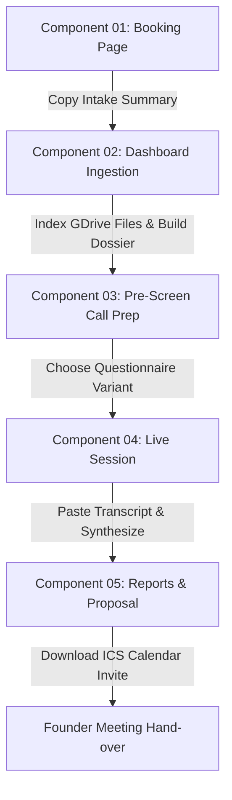

# Tiny AI Assistant - Complete Product Documentation & User Guide

Welcome to the official documentation and user guide for the **Tiny AI Assistant**. This tool is an intelligent sales operations assistant designed to support sales representatives like Albert and Isha in preparing for discovery calls, conducting client sessions, and generating professional follow-up deliverables.

---

## 1. Product Architecture Overview

The Tiny AI Assistant orchestrates a 5-component sales process, moving from initial lead capture to final founder hand-over:



---

## 2. Component 01: Client Booking Page (`book.html`)

The booking flow handles pre-screening discovery schedules while protecting staff calendars with dynamic business rules.

### 2.1. Host Calendar Rules

When booking a meeting, select the host from the dropdown. The system dynamically enforces distinct scheduling rules:

* **Shared Calendar (Albert / Isha)**:
  * **Buffer**: 12-hour buffer (same-day slots are blocked).
  * **Dates**: Current month dates displayed.
  * **Format**: In-person (Richmond office) or online options.
* **Amendra Pratap (Director)** & **Steny (Partner)**:
  * **Buffer**: 12-hour buffer.
  * **Dates**: Current month dates displayed.
  * **Format**: In-person (Richmond office) or online options.
* **Kevin (TM1 Specialist & Demo Lead)**:
  * **Buffer**: 1-week buffer (slots offset to start 7 days in the future).
  * **Dates**: Displays next month dates (e.g. June).
  * **Format**: **Online Only** (Teams/Zoom). In-person selectors are disabled.

> [!WARNING]
> A dynamic notice banner `#booking-buffer-notice` warns the booking client of these constraints. The notice is always visible and shifts content dynamically based on the selected host.

### 2.2. The Intake Summary
After selecting a date/time slot, the client fills in their company info, track interest, budget, and workflow. Upon submission:
1. The page displays a confirmation.
2. A formatted **Intake Summary text** is generated.
3. Click **Copy Intake Summary** to copy this layout to the clipboard.

---

## 3. Component 02: Ingestion & Call Preparation (`index.html`)

Sales representatives paste the copied booking text into the dashboard to start preparation.

### 3.1. Parsing Lead Details
1. Open [index.html](file:///c:/Users/SkyDr/OneDrive/Desktop/PROJECTS/Anthony/demo/index.html).
2. Go to **Step 1: PREPARATION**.
3. Paste the booking summary into the intake card.
4. Click **Parse Form**. The assistant dynamically populates fields (Name, Company, Track, ERP System, etc.) and auto-selects the **Service Track** (AI vs Planning & Analytics TM1).

### 3.2. Google Drive Attachment Browser
The assistant links directly to Google Drive client files:

```
[📂 Google Drive Connected Status] -> Indicates active connection to folder: 
"Octane Software Solutions Client Folder" (ID: 1CDBacVw2GCxZJ22k7pN9nU6a4PRLmdRR)
```

* **Browse Files**: Click **Browse Folders** to retrieve files shared with the service account.
* **Navigate**: Double-click folder cards to enter subfolders. Click **Up** to go back.
* **Search**: Type in the search input box (debounced at 300ms) to search full-text file contents.
* **Attach Documents**: Click **Attach** next to any file (Google Doc, Google Sheet, PDF, or TXT). The system extracts the parsed text buffer and caches it for LLM context.

### 3.3. Dossier Generation
1. Click **Generate Prospect Preparation Dossier**.
2. The assistant evaluates the data and compiles a **12-Point Dossier**.
3. **Dossier Completeness Meter**: Ranges from 0--100% based on the presence of the 12 required sections.
4. **Key Added Sections**:
   * **Section 11 (Customer Profiles)**: Identifies the prospect's profile from the 9 playbook categories.
   * **Section 12 (Travel Origin)**: Computes driving distance and time from Amendra's Richmond address to the client's office.

---

## 4. Component 03: Pre-Screen Call & Rapport Guides

Once the Dossier is generated, the system opens **Step 2: SESSION** and compiles a **Rapport Guide** in the background.

### 4.1. Rapport Guide Dossier
The Rapport Guide dossier is displayed above the teleprompter. It provides immediate talking points:
* **Opening Statements**: Curated icebreakers using the prospect's background.
* **Key Facts**: Consolidated metrics (budget, consolidated sheet counts).
* **Core Pain Points**: Primary business obstacles to address.
* **Forbidden Phrases**: Warnings to prevent proposing unapproved services or discounts.

### 4.2. Battlecard Questionnaires
Depending on the call context, select a questionnaire from the dropdown menu to load specific teleprompter guides:
* **Variant A (General Discovery)**: Standard discovery script.
* **Variant B (Legacy TM1 Support)**: Target scripts for legacy on-premise upgrades.
* **Variant C (AI POC Discovery)**: Questions exploring automation opportunities.

The sales team follows the interactive questions on screen during the call.

---

## 5. Component 04 & 05: Reports Synthesis

After the call is completed, transition to **Step 3: REPORTS** to compile deliverables.

### 5.1. File & Video Attachments
* **Pasting Transcript**: Paste the raw audio transcript into the input editor.
* **Screencast URL**: Input the recording link (e.g. Teams recording or direct mp4 video file).
  * Direct video paths (`.mp4`, `.webm`) render an inline `<video>` preview player.
  * External browser links render a link card with an **Open Link ↗** trigger.

### 5.2. Deliverable Tabs
Click **Generate All Reports** to compile 9 synthesized client deliverables:
1. **Questionnaire Answers**: Formatted responses to the discovery script.
2. **Qualification & Next Steps**: Detailed scorecard evaluation.
3. **Migration Report**: Technical migration pathways (essential for TM1 on-premise upgrades).
4. **Client Recap Email**: Standard follow-up letter template.
5. **Summary Sheet**: Tabular scope breakdown.
6. **Meeting Notes**: Timeline-based meeting summary.
7. **Consultative Proposal**: Short, direct summary mapping proposed services to business pain points.
8. **Action Items**: Matrix assigning deliverables to the sales team and clients.
9. **Raw Call Transcript**: Archived meeting transcript.

### 5.3. Guardrails & Safety Protocols

> [!IMPORTANT]
> **Pricing Sovereignty Guardrails**
> * All generated pricing figures in the deliverables must strictly map to catalog standards:
>   * *watsonx AI Pilot SaaS*: A$160,000+ / year
>   * *watsonx AI Implementation*: A$125,000 (fixed)
>   * *TM1 Flight Check*: A$5,800 (fixed)
>   * *TM1 DevOps Blue Support*: A$4,560 / month
> * If the prospect requested custom discounts or out-of-catalog items in the transcript, the model blocks the request and inserts the default catalog rate, appending the **Grounded Pricing Failsafe** warning.

---

## 6. Component 06: Meeting Booking & Hand-over

Once reports are compiled, the sales representative must book a Positional Meeting with a Senior Architect (Amendra Pratap) to handover the lead.

1. Locate the **Book Positional Meeting** card.
2. Enter the meeting date/time, client details, and choose format (In-Person Richmond vs Online).
3. Click **Book and Download invite**.
4. The system:
   * Compiles an RFC 5545 `.ics` calendar invitation file.
   * Enrolls Amie Lebios as organizer, and Amendra Pratap and the client as attendees.
   * Triggers an automatic download of the calendar file.
   * Replaces the scheduling inputs with a **Confirmation Card** stating attendees, dates in UTC, and next-step checklist instructions.

---

## 7. History & Call Recording Directory

The assistant tracks and saves all active dashboard sessions:
* **Directory Workspace**: Access the **Call Directory** from the navigation bar.
* **Lead Cards**: Lists all past preparation dossiers and synthesis runs.
* **Workspace Restoration**: Click **Load Console** on any card to restore the dashboard back to its exact state (populated variables, attached files, transcript, and all 9 generated report contents).
